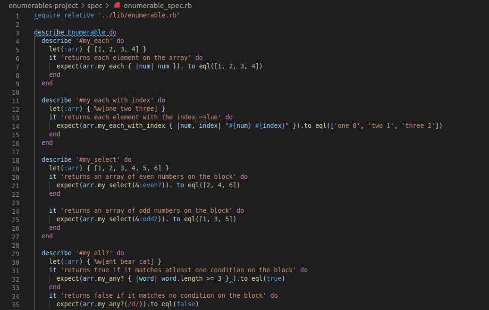

# enumerables-project_test_case
This project is the seventh one in Ruby module at Microverse. In this project, we created custom test cases for enumerables methods for the following:
- #my_each
- #my_each_with_index
- #select
- #my_all?
- #my_any?
- #my_none?
- #my_count
- #my_map
- #my_inject
- #multiply_els

## Built With

- Ruby

## Getting Started

This project involves creating test cases for the custom enumerables methods to emulate the regular ruby enumerables in terms of functionality. 

### Prerequisites

To get this project up and running, you must have Ruby installed on your machine.

### Installation

**To get this project set up on your local machine, follow these simple steps:**

- Clone the github repository https://github.com/enaburekhan/enumerables-project/tree/enum_test on your local machine
- Cd into the clone folder  
- Add Ruby github/workflows
- Install ruby extension pack on your IDE or code editor
- After creating the various custom enumerables method and the enumerable_spec on the clone folder.
- Run rspec to execute the script file
- Run rubocop on your working folder and fix errors
- stage, commit, push to the created remote branch(feature-branch) on github and create a pull request.

## Author

👤 **Eric Enaburekhan**

- Github: [@enaburekhan](https://github.com/enaburekhan)
- Twitter: [@enaburekhaneric](https://twitter.com/enaburekhaneric)
- Linkedin: [@ericenaburekhan](https://www.linkedin.com/in/eric-enaburekhan-801a28100/)

👤 **Oluwaseun Iyadi**

- Github: [@CornerstoneII](https://github.com/CornerstoneII)
- Twitter: [@It_Iz_I](https://twitter.com/It_Iz_I))
- Linkedin: [Oluwaseun Iyadi](https://www.linkedin.com/in/oluwaseun-iyadi-773584b4/)

## Show your support

If you've read this far, pls give us a ⭐️!

## Acknowledgments

- My thanks also goes to Microverse and all our peers and colleagues there.

